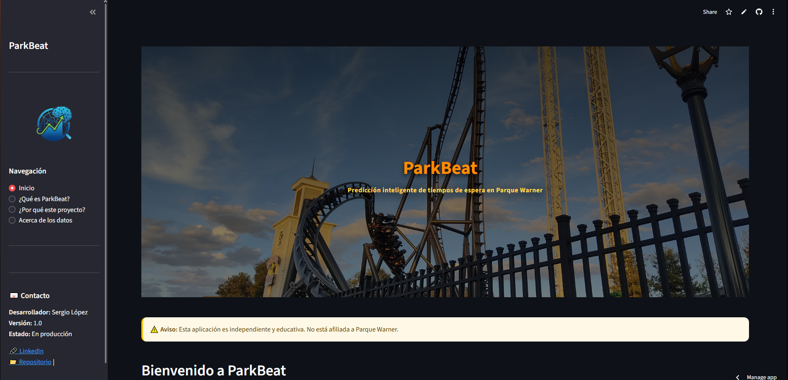
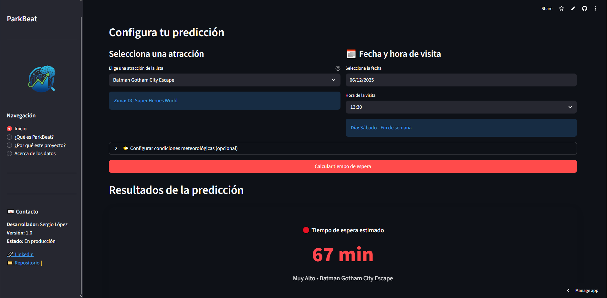
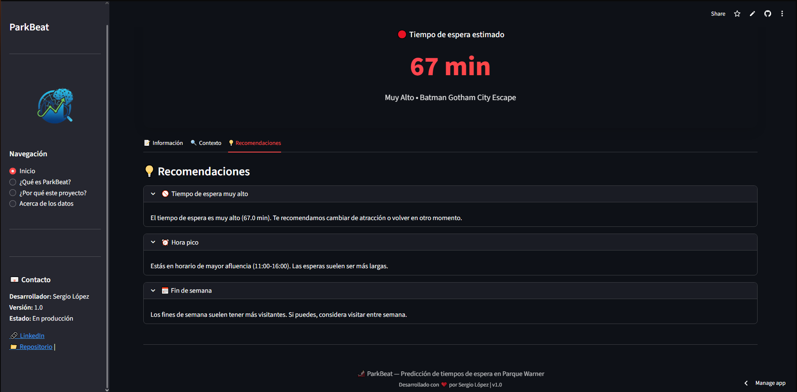

# ParkBeat
**Predicción inteligente de tiempos de espera de Parque Warner**

ParkBeat es una plataforma inteligente diseñada para transformar la manera en que los usuarios descubren, planifican y disfrutan los parques temáticos. Combina análisis de datos, predicción de afluencia, machine learning y experiencias personalizadas para ofrecer una visión clara, útil y accionable sobre el estado de un parque en tiempo real y a futuro.

---

## 🧭 Índice

- [Descripción general](#-descripción-general)  
- [Características principales](#-características-principales)  
- [Tecnologías utilizadas](#️-tecnologías-utilizadas)   
- [Capturas de pantalla](#capturas-de-pantalla)  
- [Funcionamiento de la predicción](#-funcionamiento-de-la-predicción)  
- [Interfaz y experiencia de usuario](#-interfaz-y-experiencia-de-usuario)  
- [Casos de uso](#-casos-de-uso)  
- [Retorno de valor para parques y empresas](#-retorno-de-valor-para-parques-y-empresas)  
- [Roadmap del proyecto](#️-roadmap-del-proyecto)  
- [Instalación y ejecución](#-instalación-y-ejecución)  
- [Contribuciones](#-contribuciones)  
- [Licencia](#-licencia)  
- [Contacto](#contacto)  

---

## 🏰 Descripción general

Los parques temáticos viven fluctuaciones de afluencia constantes, difíciles de predecir y de comunicar. Esto afecta a:

- La experiencia del visitante  
- Las decisiones operativas  
- La optimización de recursos  
- Las ventas y la satisfacción global  

ParkBeat nace para resolver esta falta de visibilidad, ofreciendo un sistema de predicción preciso, visual y eficiente, que permite anticiparse a los picos de afluencia y planificar mejor cada visita.

El objetivo es crear la herramienta de referencia para entender y prever el pulso (“beat”) del parque.

---

## 🚀 Características principales

### 🔮 Predicción horaria de afluencia
- Modelos de Machine Learning entrenados con datos históricos.  
- Pronóstico por horas.
- Detección de patrones especiales: festivos, climatología adversa, periodos vacacionales.  

### ☁️ Integración meteorológica
- Datos en tiempo real mediante la API de Queue-Times- 
- Ajustes en el modelo según lluvia, temperatura.  

### 📍 Mapa inteligente (en desarrollo)
- Zonas calientes del parque.  
- Detección de saturación.  
- Visualización clara y accesible.  

### 📊 Panel analítico (en desarrollo)
- Gráficas comparativas entre días.  
- Tendencias históricas.  
- Estimación de tiempo óptimo para visitar.  

### 🎯 Recomendaciones personalizadas
- “Mejor hora para visitar hoy”.  
- “Evita esta zona durante los próximos 30 min”.  
- “Plan ideal según tu perfil (familia, thrill-seeker, niños…)”.  

### ❤️ Experiencia para el visitante
- Navegación fluida, minimalista y moderna.  
- Modo oscuro / claro.  
- Totalmente optimizada para móviles.  

---

## 🛠️ Tecnologías utilizadas

**Frontend**  
- Python + Streamlit  
- HTML/CSS inyectado para personalización avanzada  
- Gráficas dinámicas con Matplotlib / Plotly  
- Responsive design  

**Backend / Data**  
- Python  
- Modelos estadísticos + regresión  
- Preprocesamiento automático  
- Data pipelines end to end

## Capturas de pantalla

Aquí se puede ver unas capturas de pantalla de la interfaz sobre un caso de uso.

## 🤖 Funcionamiento de la predicción

1. **Ingesta de datos**  
   - Históricos por día y hora  
   - Variables meteorológicas  
   - Temporadas, festivos

2. **Procesado y feature engineering**  
   - Normalización  
   - Detección de anomalías  
   - Construcción de indicadores  

3. **Entrenamiento del modelo**  
   - Regresión avanzada 
   - Evaluación por tramos horarios  
   - Selección automática del mejor modelo  

4. **Predicción real-time**   
   - Ajustes según clima del día  

5. **Visualización**  
   - Gráficas horarias  
   - Recomendaciones  
   - Mapas de actividad  

---

## 🎨 Interfaz y experiencia de usuario

- Diseño centrado en claridad y velocidad  
- Interactivo
- Modo oscuro totalmente integrado  
- Animaciones suaves y colores corporativos  
- Compatible con navegador móvil  

---

## 🧠 Casos de uso

### 👥 Para el visitante
- Elegir el mejor momento para ir  
- Evitar colas y zonas saturadas  
- Planificar la visita completa  
- Consultar previsión para mañana o el fin de semana  

### 🏢 Para el parque
- Optimizar la asignación de personal  
- Mejorar la comunicación al visitante  
- Identificar patrones clave  
- Aumentar satisfacción, ventas y eficiencia operativa  

---

## 💼 Retorno de valor para parques y empresas

**Beneficios directos:**  
- Reducción de saturación en horas punta  
- Mejora de la imagen del parque  
- Señalización inteligente basada en datos  
- Incremento en consumo dentro del parque  
- Visitas mejor distribuidas durante el día  

**Beneficios estratégicos:**  
- Sistema escalable a múltiples parques  
- Análisis agregado por temporada  
- Datos valiosos para decisiones de negocio  
- Potencial integración con apps oficiales  

---

## 🗺️ Roadmap del proyecto

-  **Fase 1 — MVP (completada)**  
  Predicción horaria, UI completa, modo oscuro, gráficas y métricas  

-  **Fase 2 — Consolidación**  
  API propia, modelos más precisos, alertas inteligentes  

-  **Fase 3 — Expansión**  
  Multi-parque, dashboard para operadores, IA generativa para planificación  

---
## Licencia

Este proyecto ha sido desarrollado por Sergio López. Proyecto no afiliado a Parque Warner.

---
## Contacto

- LinkedIn: [Sergio López](https://linkedin.com/in/sergio-lopez-dev)

